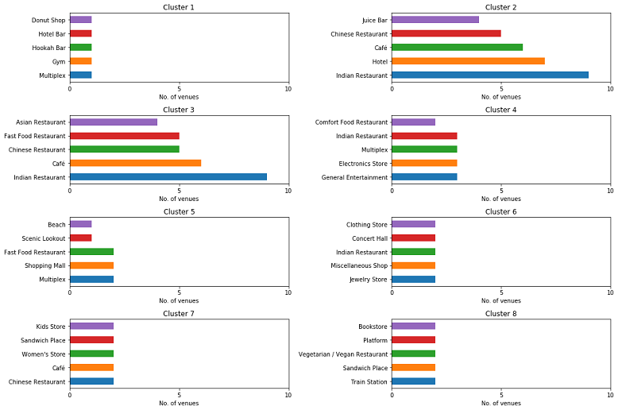
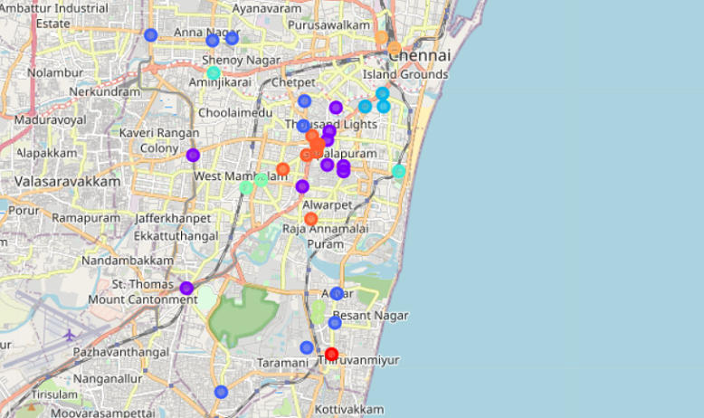

# The Battle of Neighborhoods - Chennai

## Table of contents:
1. [Introduction: Business Problem](#intro)
2. [Data Requirements](#data)
3. [Methodology](#methodology)
4. [Analysis](#analysis)
5. [Results and Discussion](#results)
6. [Conclusion](#conclusion)

## Introduction: Business Problem 

This project deals with discussing the neighborhoods of **Chennai, The Detroit of India**. This would specifically help Business people planning to start **Restaurants, Hotels, etc.** in Chennai, Tamil Nadu, India.

The **Foursquare API** is used to access the venues in the neighborhoods. Since, it returns less venues in the neighborhoods, we would be analysing areas for which countable number of venues are obtained. Then they are clustered based on their venues using Data Science Techniques. Here the **k-means clustering algorithm** is used to achieve the task. The optimal number of clusters can be obtained using **silhouette score** metrics. **Folium visualization library** can be used to visualize the clusters superimposed on the map of Chennai city. These clusters can be analyzed to help small scale business owners select a suitable location for their need such as Hotels, Shopping Malls, Restaurants or even specifically Indian restaurants or Coffee shops.

The major **Target Audience** would be small-scale business owners and stake holders planning to start their business at a location in Chennai. This project would help them find the optimal location based on the category of their business such as,

*	What is the best location to start a new hotel in Chennai with restaurants around?
*	Which area is best suitable for opening a Shopping Mall in Chennai?

## Data Requirements 

Chennai has multiple neighborhoods. The chennaiiq.com website has a dataset which has the list of locations in Chennai along with their Latitude and Longitude. In order to obtain the venue details in each neighborhood Foursquare API is used.

1.	https://chennaiiq.com/chennai/latitude_longitude_areas.asp
2.	https://foursquare.com/

There is a total of 105 neighborhoods. But the Latitude and Longitude data obtained are in Degrees Minute Seconds format which needs to be converted to Decimal Degrees Format. The following data are obtained from the Foursquare API, 

*	Venue
*	Venue Latitude
*	Venue Longitude
*	Venue Category data

A total of 1130 venues data have been obtained from Foursquare.

## Methodology 

Now, we have the neighborhoods data of chennai (**105 neighborhoods**). We also have the most popular venues in each neighborhood obtained using Foursquare API. A total of **1130 venues** have been obtained in the whole city and **145 unique categories**. But as seen we have multiple neighborhoods with less than 10 venues returned. In order to create a good analysis let's consider only the **_neighborhoods with more than 10 venues_**.

We can perform one hot encoding on the obtained data set and use it find the **10 most common venue category** in each neighborhood. Then clustering can be performed on the dataset. Here **K - Nearest Neighbor** clustering technique have been used. To find the optimal number of clusters **silhouette score** metric technique is used.

The clusters obtained can be analyzed to find the major type of venue categories in each cluster. This data can be used to suggest business people, suitable locations based on the category.

## Analysis 

Looking into the dataset we found that there were many neighborhoods with less than 10 venues which can be remove before performing the analysis to obtain better results. The following plot shows only the neighborhoods from which 10 or more than 10 venues were obtained. The resultant dataset consists of **37 neighborhoods**. 

  

Next, we will perform one hot encoding on the filtered data to obtain the venue categories in each neighborhood. Then group the data by neighborhood and take the mean value of the frequency of occurrence of each category. This is used to obtain the top 10 most common venues in each neighborhood i.e. the 10 venues with the highest mean of frequency of occurrence. The resultant dataset can be used for the clustering algorithm. Here, the K-Nearest Neighbor (KNN) clustering algorithm is used. It is an unsupervised machine learning technique that clusters the given data into K number of clusters. For optimal result we need to select the best value for K. Here, the silhouette score is used to find the best value for K. A range of values from 2 to 10 was considered, KNN clustering was performed on the dataset and the silhouette score was calculated and plotted on a line plot. From the plot we can see that a K value of 8 provides the best score. This K value is used for the K-Means Clustering Technique. The K-Means labels obtained were included in the top neighborhoods dataset for examining the characteristics of each cluster.

  

## Results and Discussion 

Using the clusters and the top venue categories let’s visualize the top 5 venue category in each Cluster for comparison. 

  

This plot can be used to suggest valuable information to Business persons. Let's discuss a few examples considering they would like to start the following category of business.

#### 1. Hotel

The neighborhoods in cluster 2 has the greatest number of hotels, hence opening one here is not the best choice. So, is it best to open one at the neighborhoods in cluster 7 or 8? Not likely, since the place has a smaller number of food restaurants. Thus, an optimal place would be one which has less hotels, but also have restaurants and other places to explore. Considering all these facts, the best choice would be Cluster 3 and Cluster 4. such as the Adyar Bus Depot, Triplicane neighborhoods.

#### 2. Shopping Mall

The neighborhoods 5 has notable number of shopping malls. By using the same procedure as above, the suitable cluster would be the Cluster 2 and Cluster 3, since it has not much shopping malls and also it has many Hotels and Restaurants which gives an advantage.

Similarly, based on the requirement suggestions can be provided about the neighborhood that would be best suitable for the business. The following is a map of Chennai with the neighborhood clusters superimposed on top of it. This map can be used to suggest a vast location to start a new business based on the category.

  

For example, the highlighted location shown in the below figure consists of Cluster 3 and Cluster 5, whose neighborhoods have many Restaurants and Shopping Malls but less Hotels. Thus, this would be a suitable location for building a hotel.

  

## Conclusion 

Purpose of this project was to analyze the neighborhoods of Chennai and create a clustering model to suggest personals places to start a new business based on the category. The neighborhoods data was obtained from an online source and the Foursquare API was used to find the major venues in each neighborhood. But we found that many neighborhoods had less than 10 venues returned. In order to build a good Data Science model, we filtered out these locations. The remaining locations were used to create a clustering model. The best number of clusters i.e. 8 was obtained using the silhouette score. Each cluster was examined to find the most venue categories present, that defines the characteristics for that particular cluster. 

A few examples for the applications that the clusters can be used for have also been discussed. A map showing the clusters have been provided. Both these can be used by stakeholders to decide the location for the particular type of business. A major drawback of this project was that the Foursquare API returned only few venues in each neighborhood. As a future improvement, better data sources can be used to obtain more venues in each neighborhood. This way the neighborhoods that were filtered out can be included in the clustering analysis to create a better decision model.

## Thank you!

I hope you found the project useful and interesting. This project was deveoped for the **Applied Data Science Capstone** as part of the **IBM Data Science Professional Certificate** provided through Coursera. Feel free to fork or download this project for your requirements.

-- [Rohith S P](https://www.linkedin.com/in/rohithsp/)
